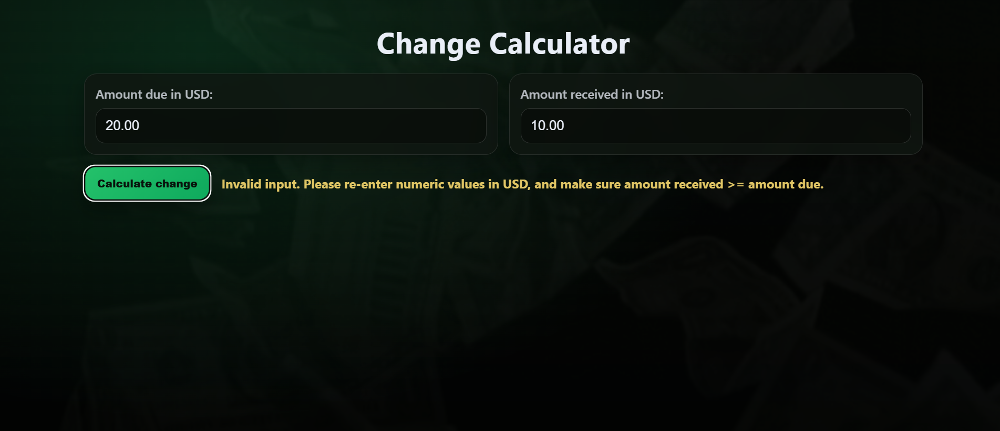

# Change Calculator

A responsive client-side application that computes monetary change and renders an animated, itemized breakdown of bills and coins. This project emphasizes structured JavaScript design, defensive input validation, dynamic DOM manipulation, and responsive UI implementation using vanilla web technologies.

---

## Live Demo

View the live project here:  
https://awaddell-dev.github.io/Change-Calculator/

---

## Features

* Calculates total change from amount due and amount received  
* Breaks change down into:
  * $20, $10, $5, $2, $1 bills  
  * Quarters, dimes, nickels, pennies  
* Animated number transitions using `requestAnimationFrame`  
* Slide-in results section  
* Conditional rendering (hides zero-value denominations)  
* Input validation with clear error messaging  
* Responsive layout for desktop and mobile  
* Modern dark money-themed UI    

---

## Tech Stack

* HTML5 – structure and markup  
* CSS3 – layout, responsiveness, and theming  
* JavaScript (ES6) – calculation logic, DOM manipulation, animation  
* Git – version control  
* GitHub Pages – deployment  

---

## Architecture Overview

The application follows a structured separation of concerns:

* **Calculation Logic** – Determines change and denomination breakdown
* **Rendering Logic** – Updates the DOM based on computed results
* **Event Handling** – Listens for user interaction and validates input
* **UI Utilities** – Manages conditional visibility and animations

All logic is implemented using vanilla JavaScript with clear function boundaries.

---

## Screenshots

### Initial Interface


---

### Valid Input Entered


---

### Invalid Input State

Displays validation messaging when input is invalid or amount received is less than amount due.



---

### Example Change Breakdown


---

## Accessibility & Testing Considerations

* Screen-reader-only elements are used to support automated test validation
* Defensive checks prevent invalid numeric states
* Animations gracefully bypass automated test environments
* Semantic HTML structure improves readability and accessibility

The goal was to balance enhanced UI experience with predictable test behavior.

---

## Installation & Usage

Clone the repository:

```bash
git clone git@github.com:awaddell-dev/Change-Calculator.git
```
---

## Author

* Alex Waddell
* Software Development Student: California Institute of Applied Technology
* Software Development Intern: Creating Coding Careers
* Github: https://github.com/awaddell-dev
* LinkedIn: 

